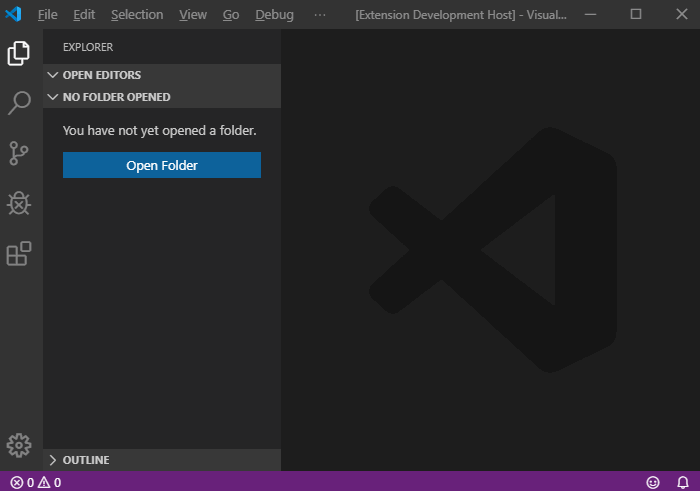
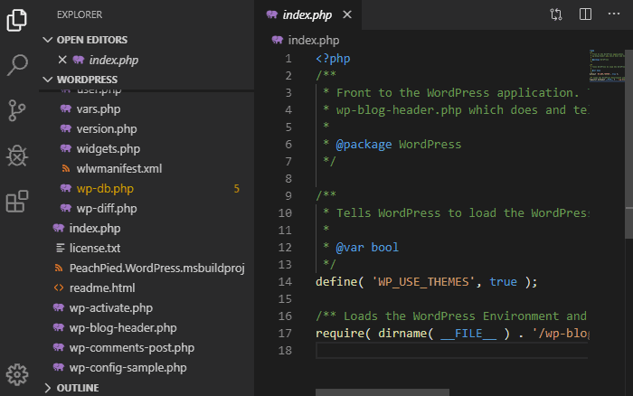
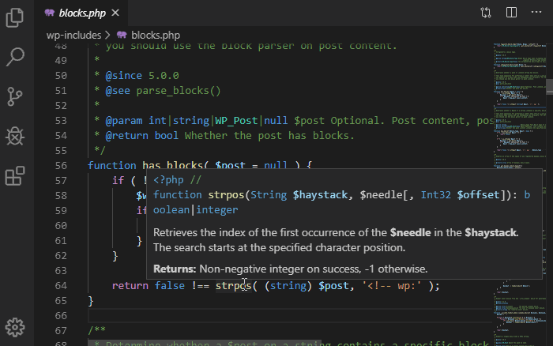

# PeachPie Compiler for Visual Studio Code

Welcome to the official extension of [PeachPie Compiler](https://www.peachpie.io/) - the PHP language compiler for .NET.

The extension runs the compiler analysis in the background and extends the editor, providing PHP code diagnostics, enabling debugging, and helping with running PHP code on .NET.

### New Project

Quickly create the project file for PHP on .NET within Visual Studio Code. For more information see our [Get Started](https://www.peachpie.io/getstarted) page.

Go to VSCode's `Command Palette` and create the project. The command restores the required .NET dependencies and initializes `tasks.json` for you.

### Diagnostics

Once the project is created, the compiler analysis runs in the background, providing a list of problems within the entire workspace.

### Rich Tooltips

Insights about resolved types and symbols are accessible through tooltips. They reveal how the compiler sees types and display remarks and descriptions of resolved symbols.

### Debugging

The code runs on the .NET CLR, taking full advantage of its debugger and related features.

- Set breakpoints and step through the code.
- Check the *Output* panel for runtime events and warnings.
- Watch the call stack, inspect variables, watch locals.

## Remarks

- The [.NET Core SDK](https://dotnet.microsoft.com/download) is required.
- [C# for Visual Studio Code](https://marketplace.visualstudio.com/items?itemName=ms-vscode.csharp) is required.

*PeachPie is a work in progress. Please see the [project repository](https://www.github.com/iolevel/peachpie) for issues or for ways how to contribute. Visit the [project website](https://www.peachpie.io/) for more information.*
