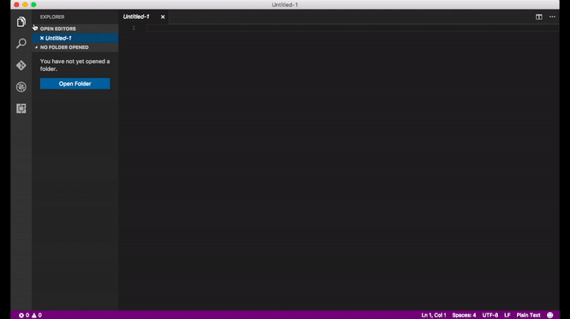
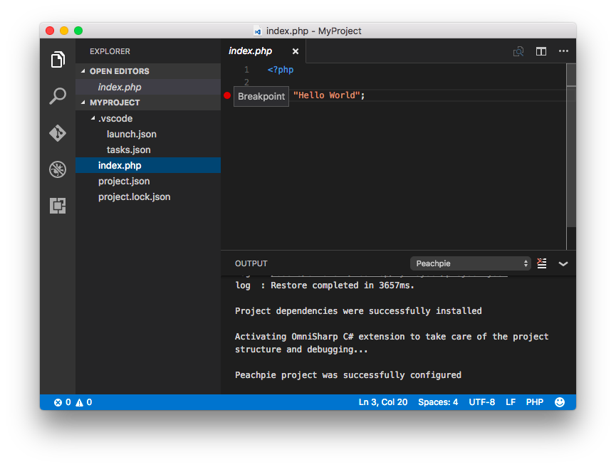
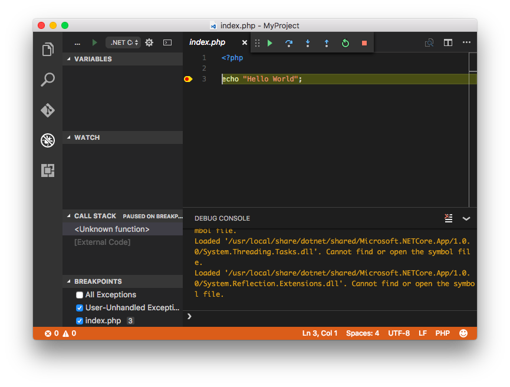
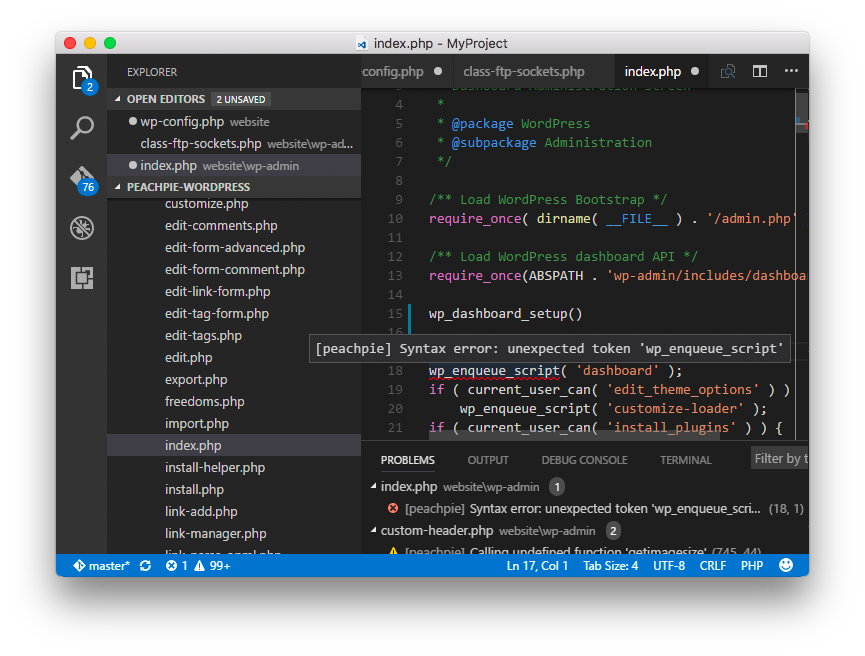
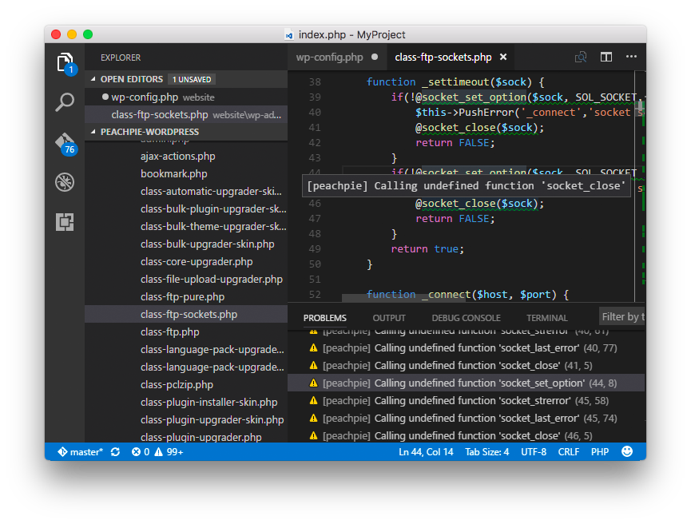

# PeachPie for Visual Studio Code

This is the official extension of PeachPie for Visual Studio Code. It integrates the PHP compiler to .NET into VSCode, automatically downloading the required dependencies and allowing for a comfortable development experience with PeachPie.

> Please note that PeachPie compiler is still a work in progress. Therefore, some functionalities are not yet supported. For an updated list of supported constructs, please see [our roadmap](https://github.com/iolevel/PeachPie/wiki/PeachPie-Roadmap).

## Features

* Adds 'Create Project' command directly in Visual Studio Code
* Automatically downloads PeachPie dependencies
* Automatically enables the C# extension, if already installed
* Enables breakpoints in .php files
* Underlining of syntax errors
* PeachPie Diagnostics underlining missing or not yet implemented functions

*'Create Project' with PeachPie* 

*Adding breakpoints in .php files*

*Debugging PHP in VSCode*

*Syntax error highlighting*

*PeachPie Diagnostics*

## Requirements

It is necessary to install the C# for Visual Studio Code extension first. Check out the extension in the [VSCode Marketplace](https://marketplace.visualstudio.com/items?itemName=ms-vscode.csharp) and download it directly in VSCode by typing the command `ext install csharp`.

## Known Issues

PeachPie compiler is a work in progress, and thus many functionalities are not yet supported. Please see the project's [repository](https://www.github.com/iolevel/PeachPie) for limitations, supported constructs and specifications.

## Release Notes

### 0.9.0
- Project template targets PeachPie 0.9.0
- A lot more diagnostics
- PeachPie 0.9.0 enhancements includes traits, generators, compiler fixes

### 0.8.0
- Projects target PeachPie 0.8.0

### 0.7.0
- Re-enabled PeachPie project diagnostics
- New projects target PeachPie 0.7.0

### 0.6.0
- Support for new msbuild project format
- `project.json` deprecated and removed
- Updated `Create Project` command

### 0.5.0

- New project refers to PeachPie 0.5.0
- Underlining of syntax errors
- Code Analysis diagnostics

### 0.3.0

- Initial release

-----------------------------------------------------------------------------------------------------------

### For more information

For more information, please visit:
* [The project website](http://www.PeachPie.io)
* [The GitHub repository](https://github.com/iolevel/PeachPie)

**Enjoy!**
